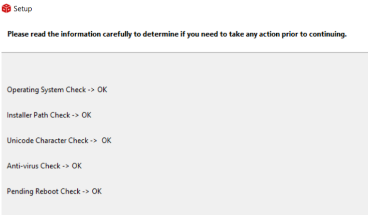
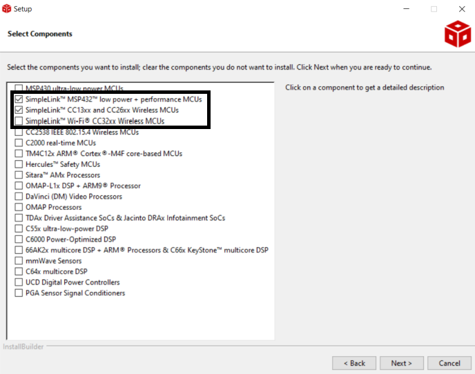
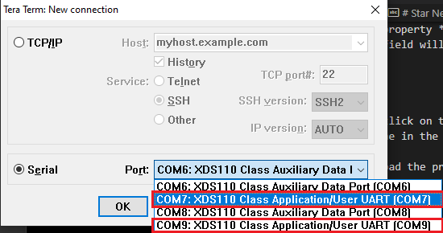
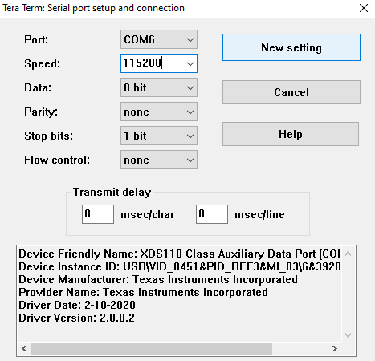
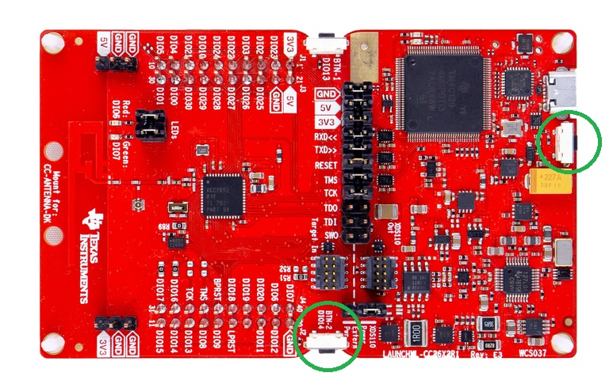
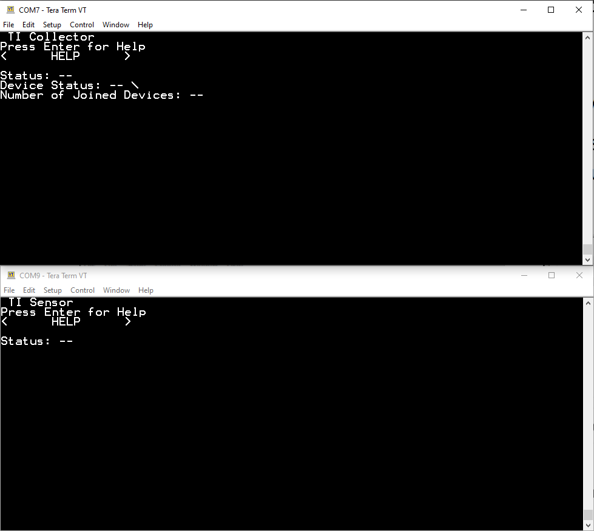
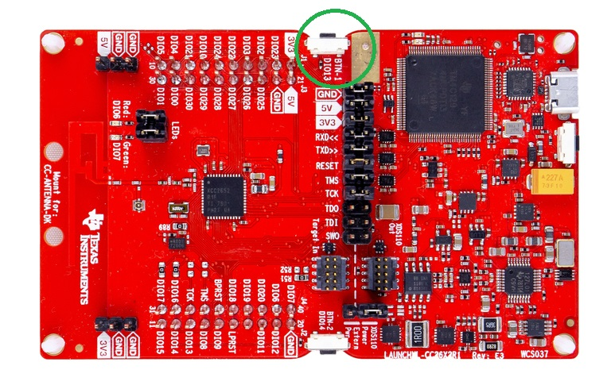
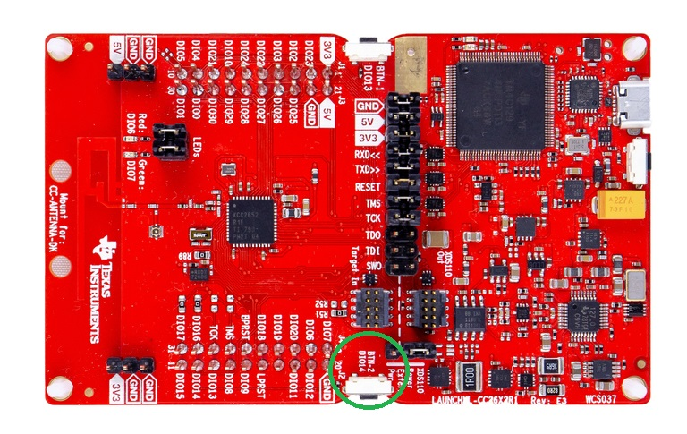
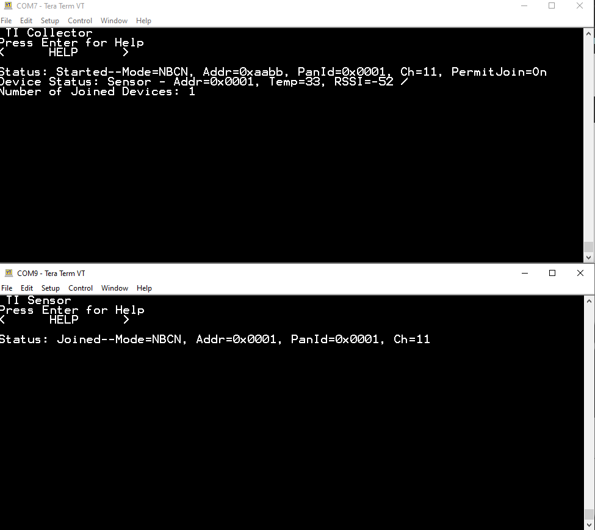

# Star Network System

A system that connects Texas Instruments' CC2652RB microcontrollers as nodes of a star-shaped network.

## User Guide

1. Download Code Composer Studio (IDE) from: https://www.ti.com/tool/CCSTUDIO

    - Choose the **Single File** option:

    

    - Before the installation, it is recommended to turn off the PC's antivirus so that the installation goes as ideally.

    - Extract the `.zip` file.

2. All lines below are *suggested* to say OK so that we can proceed to install the IDE program.



3. In the next prompt, check the three boxes below:



4. Download the SDK (Software Development Kit) for the CC26x2 boards from: https://www.ti.com/tool/SIMPLELINK-CC13XX-CC26XX-SDK

5. Depending on the OS:

    - For Windows: install the terminal emulator Tera Term (Full Instalation) from: https://tera-term.softonic.com/

    - For Linux (Ubuntu 20.04 was used): 

    ```
    sudo apt install setserial
    sudo apt install cu
    ```

    To get the serial port (COM port) that the board is plugged in, type:

    ```
    sudo setserial -g /dev/ttyS[0123456789]
    ``` 

    And the port (tty0, for example), will be the only one that does not say `UART: unknown`. That is the board's port, and it should have a name `tty[0-9]` or `ttyS[0-9]`. Another option is to type:

    ```
    dmesg | grep tty
    ```

    Now, to finally connect to the board via serial port, type:

    ```
    sudo chmod 666 /dev/ttyS0
    sudo cu -l /dev/ttyS0 -s 115200
    ```

    The last command should output: `Connected.`. To disconnect from the board, type:

    ```
    ~.
    ```

### Collector Node - Load System

1. Open Code Composer Studio

2. `Project > Import CCS Projects...`

3. Click on the *Browse* button at the top line's right corner. Navigate to your files to the route of the SDK's folder, which will look something similar to this:

`C:\ti\simplelink_cc13xx_cc26xx_sdk_5_40_00_40\examples\rtos\LP_CC2652RB\ti154stack\collector\tirtos7\ccs`

Once in the `ccs` folder, click on *Select Folder*.

4. A checked box will appear on the prompt, with the project inside the directory just chosen, if it is not checked, please check it.

5. Click on *Finish*.

6. Once the project is loaded in CCS, go to its folder *targetConfigs* and finally click on its file `CC2652RB1F.ccxml`.

7. Make sure that in the left panel the cell that says `CC2652RB1F` is already checked, otherwise it's probably the wrong project.

8. On the right panel, click on *Target Configurations*.

9. In the new panel, click on *Texas Instruments XDS110 USB Debug Probe* and it will display a set of options in the right side. Look for the property *“Debug Probe Selection* and on its menu choose *Select by serial number*. Another text field will appear below it, please type the board's serial number.

10. Click on *Save*.

11. Now, on the CCS's *Project Explorer* View, click on the folder we just loaded from the examples at the SDK's directory, named as the one in the checked box of step 4.

12. Click on the button with the green bug to load the project onto the board.

13. Wait until the console in CCS says:

```
Cortex_M4_0: GEL Output: Memory Map Initialization Complete.
Cortex_M4_0: GEL Output: Memory Map Initialization Complete.
Cortex_M4_0: GEL Output: Board Reset Complete.
```

### Sensor Node - Load System

Something almost similar:

1. Open Code Composer Studio

2. `Project > Import CCS Projects...`

3. Click on the *Browse* button at the top line's right corner. Navigate to your files to the route of the SDK's folder, which will look something similar to this:

`C:\ti\simplelink_cc13xx_cc26xx_sdk_5_40_00_40\examples\rtos\LP_CC2652RB\ti154stack\sensor\tirtos7\ccs`

Once in the `ccs` folder, click on *Select Folder*.

4. A checked box will appear on the prompt, with the project inside the directory just chosen, if it is not checked, please check it.

5. Click on *Finish*.

6. Load the project onto the sensor board the same way we did the collector's.

## Tera Term: Connect The Network For the First Time

1. Open two instances of Tera Term program. This program is similar to PuTTY: its purpose is only to provide an interface to connect to serial ports and see its output.

2. Choose the *Serial* radial button for both instances, and for each of them, choose one UART port:



3. Click *OK*.

4. For both instances, go to `Set Up > Serial Port` and make sure the fields are the same to the ones below:



5. Click on *New Setting*.

### Collector Node

1. Click on both of these buttons **at the same time** (BTN-2 + RESET):



And this will reset the boards. The outcome in Tera Term will look as follows (Collector and Sensor Node):



2. On the Collector Node, press the button shown below (BTN-1):



This will make the node go out of Waiting mode, and the red LED will turn on.

3. To allow the other nodes to connect to this network, press the button below (BTN-2):



This will make the red LED blink on the Collector node.

### Sensor Node

1. To connect a sensor node, press, on the Sensor device, the button below (BTN-1):


Making the output Status be *Starting* and the red LED will turn on.

The terminal now for the nodes will look as follows:



Showing in this case that 1 node is connected to the Collector.

## Python: Read The Data Being Sent

1. Unplug both of the devices.

2. Run the python code [here](https://github.com/the-other-mariana/star-network/blob/master/manual/SerialData/SerialDataWriter.py) on two instances of the terminal you wish.

3. Plug both the nodes to the PC.

4. Type on each python programs, the COM port of each of the devices.

- Collector:

```
Serial port: COM9
```

- Sensor:

```
Serial port: COM7
```

5. Perform the same button pressing of the section above. Do not expect any output in the terminals, but once you connect the sensor node, the data sent will be printed in the terminal:

```
Serial port: COM7
None
None
None
None
None
None
None
None
None
None
None
None
0x0001 32 -64 2022-03-10 19:26:58.685076 0

0x0001 32 -54 2022-03-10 19:27:00.943808 1

0x0001 32 -54 2022-03-10 19:27:04.386600 1

0x0001 32 -51 2022-03-10 19:27:07.386576 1

0x0001 32 -51 2022-03-10 19:27:10.386552 1

0x0001 32 -51 2022-03-10 19:27:13.387528 1

0x0001 32 -50 2022-03-10 19:27:16.386505 1
```

