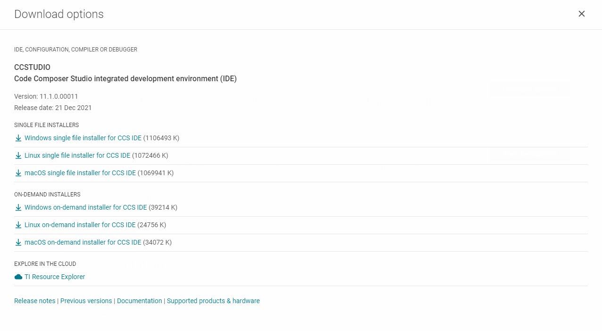

# Star Network System

A system that connects Texas Instruments' CC2652RB microcontrollers as nodes of a star-shaped network.

## User Guide

1. Download Code Composer Studio (IDE) from: https://www.ti.com/tool/CCSTUDIO

    - Choose the **Single File** option:

    