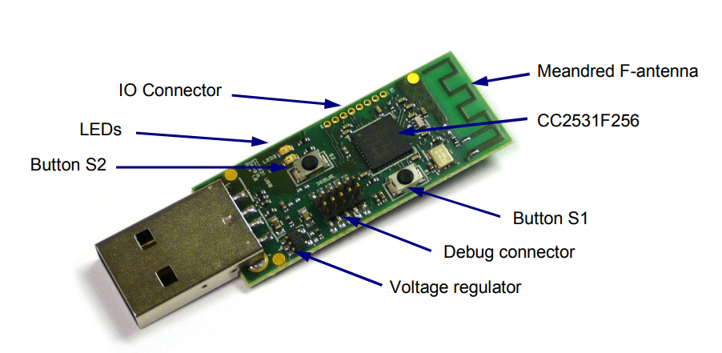
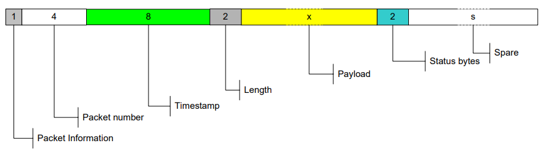
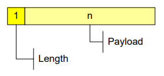
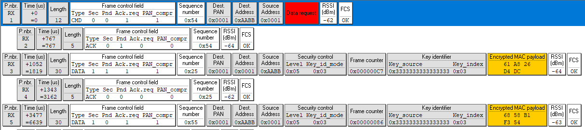
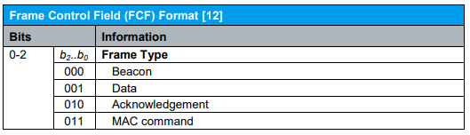

# The PSD File Format



| Requierement | Description |
| --- | --- |
| Software | TI SmartRF Packet Sniffer 2.18.1 |
| Sniffer (Chip) | CC2531 USB Dongle |

*Note: CC2531 is the chip in CC2531EMK — CC2531 Evaluation Module Kit: The CC2531EMK kit provides one CC2531 USB Dongle and documentation*.

## Format of packets saved to file

The figure below describes the packet format for **packets saved** to a Packet Sniffer Data (PSD) file. The number of bytes is given for each field.



1. **Packet Information**: Contains information used by the packet sniffer to read the data correctly:

    - Bit 0: (Packet) Length includes FCS (frame status bytes)

    - Bit 1: Correlation used

    - Bit 2: Incomplete packet

    - Bit 3: Buffer overflow

    - Bit 4: Generic protocol (Generic Sniffer is used)

    - Bit 5-7:  Not used

2. **Timestamp**: 64 bit counter value. To calculate the time in microseconds this value must be divided by a number **depending on the clock speed** used to drive the counter tics on the target.

> CC243xEM, CC253x -> 32, CCxx10EM -> 26, SmartRF05EB + CC2520EM -> 24

The timestamp on the first packet will be used as offset value for all packets: that means that packet number 1 will be shown in the packet sniffer with time = 0.

3. **Length**: The length will include the Payload (this is **the** data sent by some device you program) and the two status bytes.

*Note: This is the length defined in the packet sniffer data format. For packets of variable length, the payload will also start with a length byte.*

4. **Payload**: Payload of packet as defined in the packet sniffer data format. The payload will depend on the RF Device used as transmitter.

    - IEEE 802.15.4 devices (e.g. CC253x, CC2520, CC243x)

    

    **As per the IEEE 802.15.4 standard**, the length filed included in the packet will include the length of the payload and the two trailing FCS bytes (status bytes?).  The capture device will strip the FCS bytes from the packet and replace them with the **two status bytes described below**.

    - The packet length will include 2 bytes for the frame status depending on *bit 0* in the Packet Information byte. If the bit is set, the packet length include the frame status bytes. **The frame status format depends on the RF Device**. 

    - FCS: The checksum of the frame has been replaced by the radio chip in the following way:

        - BYTE 1: RSSI and if Correlation used, this byte is also used to calculate the LQI value.

        - BYTE 2: Bit 7: Indicate CRC OK or not.

        - Bit 6-0: If Correlation used: Correlation value.

        - If Correlation not used: LQI.

    - Note: all numbers use the little-endian format, meaning, for instnce, that the number 0x12345678 is stored as `{0x78, 0x56, 0x34, 0x12}` in the PSD-file.

5. **Status Bytes**: The Status bytes are generated by the RF Device used as capturing device. See the user guide of the capturing device for more details.

    - BYTE 1: RSSI

    - BYTE 2:

        - Bit 7: Indicate CRC OK or not

        - Bit 0-6: Depending on the RF Device and the configuration of these

6. **Spare**: 

    - The number of spare bytes depends on the total amount of bytes used by the packet sniffer to save the packet

    - The number of bytes depends on the protocol and can be seen from the **description of the packet format** under the help menu.

*Note: displays the packets in hexadecimal format*.

- TI SmartRF Packet Sniffer install directory: `C:\Program Files (x86)\Texas Instruments\SmartRF Tools\Packet Sniffer\scripts`

## Frame Control Field

From an example psd file, after the Length field we can see the Frame Control Field:



In the psd file format, the Frame Control Field (FCF) can be found on the first byte of the PAYLOAD and is organized as follows:

- Bit 0 - 2: TYPE. The available type codes are:

    

    - These were taken from: [pdf file](papers/1GP105_1E_Generation_of_IEEE_802154_Signals.pdf), p 50.

- Bit 3: Security Enabled

- Bit 4: Frame Pending

- Bit 5: ACK Request

- Bit 6: PAN ID Compression

- Bit 7: Reserved

This was taken from: [pdf file](papers/Huang2015_Chapter_AnalysisAndComparisonOfTheIEEE.pdf), p 3.

As we read the file by bytes, we can get the type of field as:

```python
# inverted (little endian) binary form of byte: payload[0]
binary_string = "{:08b}".format(int(pckt_payload[0].hex(), 16))[::-1]
print(binary_string)
# inverted (little endian) fcf type code
fcf_type = binary_string[:3][::-1]
print(fcf_type)
```

which would output:

```python
>>>  pckt_payload[0] = b'c'
'11000110'
'011'
```

To get `011` (CMD), we delete `bits[7]` (`0`), take `bits[:3]` (`110`) and invert them. In this way, we achieve the FCF of the first packet in the above sample image of a psd file.

## References

- TI Packet Sniffer Manual: https://www.ti.com/lit/ug/swru187g/swru187g.pdf?ts=1649867575476&ref_url=https%253A%252F%252Fwww.google.com%252F

- FCS Details: https://github.com/homewsn/whsniff/blob/master/src/whsniff.c

    - libusb: https://github.com/libusb/libusb/blob/master/libusb/libusb.h

    - endian.h: https://github.com/lattera/glibc/blob/master/string/endian.h

- Convert little endian: https://stackoverflow.com/questions/1698036/convert-little-endian-string-to-integer

- Bytes to int python (little): https://stackoverflow.com/questions/57325964/how-do-i-convert-a-byte-to-an-integer-in-python-when-it-has-the-byte-markers-att

- For a single-hop network, RSSI may be used for LQI: https://microchipsupport.force.com/s/article/RSSI-vs-LQI-What-is-the-difference

- RSSI to LQI?: 

    - https://community.silabs.com/s/article/can-i-convert-lqi-values-from-the-stack-to-rssi-values-or-vice-versa-x?language=en_US

    - https://community.silabs.com/s/question/0D51M00007xeG3cSAE/lqi-and-rssi?language=es

- signed int from byte: https://stackoverflow.com/questions/17067813/convert-ascii-character-to-signed-8-bit-integer-python

- Binary representation

```
0x0000000B = 00000000 00000000 00000000 00001011
0x0B = 00000000 00001011
```

By having 2 spaces after `x`, that means the numbers are stored using 2 bytes (16 bits).

https://www.binaryconvert.com/result_signed_int.html?decimal=049049

complement: https://www.allaboutcircuits.com/textbook/digital/chpt-2/negative-binary-numbers/


